### <code>saad@github ~ $ whoami</code>

I'm an Artificial Intelligence graduate from FAST NUCES. I focus primarily on AI and everything around it — building, experimenting, and understanding how systems actually learn and behave.

I have some experience across the web stack, but it's not my main focus. I use it when needed to support ideas, not as the end goal.

Most of what I build comes from everyday problems or curiosity. Sometimes it's practical, sometimes it's completely pointless — but it's always an excuse to learn something new.

### <code>saad@github ~ $ ls ~/projects</code>

<table>
  <tr>
    <td width="50%" valign="top">
      <h4><a href="https://github.com/wlofy/LLMPDF">LLMPDF</a> · ⭐ 31</h4>
      LLM-based semantic extractor for PDFs — query, search and summarize documents.
        <code>Python</code>
    </td>
    <td width="50%" valign="top">
      <h4><a href="https://github.com/wlofy/filinglens">FilingLens</a></h4>
      Visual-first agent for SEC filings. Answers grounded in the actual page image, with page-level citations.
        <code>Python</code>
    </td>
  </tr>
  <tr>
    <td width="50%" valign="top">
      <h4><a href="https://github.com/wlofy/S-P-500-Regime-Analysis-using-HMM">S&amp;P 500 Regime Analysis</a></h4>
      Hidden Markov Models for market-regime detection, backtested Long/Cash strategy, React + FastAPI dashboard.
        <code>Python</code>
    </td>
    <td width="50%" valign="top">
      <h4><a href="https://github.com/wlofy/pulse-messenger">Pulse Messenger</a></h4>
      Full-stack messenger with a liquid-glass UI, guard rails and rate limiting.
        <code>JavaScript</code>
    </td>
  </tr>
</table>

### <code>saad@github ~ $ cat stack.txt</code>

<table>
  <tr>
    <td align="right" valign="middle"><b>Languages</b></td>
    <td>
      
      
      
      
      
      
      
    </td>
  </tr>
  <tr>
    <td align="right" valign="middle"><b>AI / ML</b></td>
    <td>
      
      
      
      
      
      
      
      
      
    </td>
  </tr>
  <tr>
    <td align="right" valign="middle"><b>LLMs / agents</b></td>
    <td>
      
      
      
      
      
    </td>
  </tr>
  <tr>
    <td align="right" valign="middle"><b>Reinforcement learning</b></td>
    <td>
      
      
      
    </td>
  </tr>
  <tr>
    <td align="right" valign="middle"><b>Backend</b></td>
    <td>
      
      
      
      
      
      
      
      
    </td>
  </tr>
  <tr>
    <td align="right" valign="middle"><b>Frontend</b></td>
    <td>
      
      
      
      
      
    </td>
  </tr>
  <tr>
    <td align="right" valign="middle"><b>Data / infra</b></td>
    <td>
      
      
      
      
      
    </td>
  </tr>
  <tr>
    <td align="right" valign="middle"><b>Design</b></td>
    <td>
      
    </td>
  </tr>
</table>

### <code>saad@github ~ $ ./contributions.sh</code>

<picture>
  <source media="(prefers-color-scheme: dark)" srcset="https://raw.githubusercontent.com/wlofy/wlofy/output/github-contribution-grid-snake-dark.svg" />
  <source media="(prefers-color-scheme: light)" srcset="https://raw.githubusercontent.com/wlofy/wlofy/output/github-contribution-grid-snake.svg" />
  
</picture>

### <code>saad@github ~ $ git log --stat</code>

  

### <code>saad@github ~ $ contact</code>

